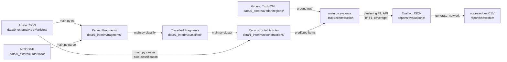

# Article Reconstruction from OCR Fragments using LLM Pipelines

Reconstructs newspaper articles from OCR text fragments by prompting an LLM through a pipelined architecture (ETL/Parse → Classify → Cluster → Evaluate). Supports two input formats: pre-extracted JSON articles and legacy ALTO XML. Includes evaluation against ground truth article XML using pairwise clustering F1, B-Cubed F1, Adjusted Rand Index (ARI), class accuracy, and coverage metrics.

Developed for Jawi (Arabic script) Malay newspapers from the Utusan Melayu 1956 collection.

## Workflow



## Project Structure

```
newspaper-reconstructor/
├── main.py                 # Typer CLI entry point (etl, parse, classify, cluster, evaluate, suggest, plan)
├── dashboard.html          # Standalone Alpine.js evaluation dashboard
├── generate_network.py     # Export eval logs to nodes/edges CSV for network visualizer
├── pipeline.sh             # Single end-to-end evaluation orchestrator
├── providers.json          # Named provider definitions (base_url, default_headers)
├── experiments/            # Batch grid-search evaluation scripts
├── scripts/                # Utility scripts (e.g. migrate_experiment_ids.py)
├── src/
│   └── newspaper_reconstructor/
│       ├── ingest.py       # Load pre-extracted JSON articles into fragment lists
│       ├── reconstruct.py  # Data parsing and LLM API mapping
│       ├── llm.py          # LLM client wrapper (OpenAI-compatible)
│       ├── evaluate.py     # Ground truth parsing, evaluation metrics
│       └── suggest.py      # LLM judge for offline analysis
├── tests/                  # Unit tests + end-to-end tests
├── prompts/                # Prompt files (e.g. classify.md, v00.md)
├── reports/
│   ├── evaluations/        # Evaluation logs (JSON)
│   ├── networks/           # Exported nodes/edges CSV
│   └── suggestions/        # Output from the LLM judge
└── data/
    ├── 0_external/           # Raw external datasets (may be git submodules)
    │   ├── <dataset_name>/   # New format (e.g. ds-articlereconstruction-20260821)
    │   │   ├── articles/     # Pre-extracted JSON: {region_id: ocr_text}
    │   │   └── regions/      # Ground truth article XML files
    │   └── <dataset_name>/   # Legacy format (e.g. ds-filteredUM1956alto)
    │       ├── alto/         # ALTO XML files (OCR text fragments)
    │       └── article_xml/  # Ground truth article XML files
    └── 1_interim/            # Interim pipeline I/O
        └── <dataset_name>/
            ├── fragments/        # Parsed JSON fragments [{id, text}]
            ├── classified/       # JSON fragments enriched with 'predicted_class'
            └── reconstructions/  # LLM clustered articles (by experiment_id)
```

## Installation

Requires Python 3.13+ and [uv](https://docs.astral.sh/uv/).

```bash
uv sync
```

The project depends on the [jawi-pipeline](../pipeline) framework via a local path source (`[tool.uv.sources]` in `pyproject.toml`); the sibling checkout must exist next to this repo.

## Configuration

Set environment variables for the LLM API, or pass them as CLI options. Works with any OpenAI-compatible endpoint (OpenAI, Ollama, vLLM, LM Studio, etc.).

| Variable         | Description                       | Default                                               |
| ---------------- | --------------------------------- | ----------------------------------------------------- |
| `LLM_API_KEY`    | API key for the LLM provider      | `"none"`                                              |
| `LLM_MODEL`      | Model name                        | Required                                              |
| `LLM_BASE_URL`   | Custom OpenAI-compatible endpoint | None                                                  |
| `LLM_PROVIDER`   | Provider name in providers.json   | None                                                  |
| `IMAGE_BASE_URL` | Base URL for page scan images     | `https://jawi.sgp1.digitaloceanspaces.com/page_scans` |

Named providers with custom `base_url` and `default_headers` can be defined in `providers.json` at the project root. When `LLM_PROVIDER` (or `--provider`) is passed, the CLI resolves the endpoint configuration from this file.

## Usage

The CLI is built with `typer` and uses subcommands to execute discrete pipeline steps.

### 0. Hardware Planning — Estimate tokens and VRAM

Estimate context length requirements before running experiments. Point this at your raw input fragments to calculate the average number of fragments and characters per page, and estimate the input tokens required (using a ~2.5 Jawi chars/token ratio).

```bash
uv run python main.py plan \
  -i data/1_interim/ds-articlereconstruction-20260821/fragments
```

### 1a. ETL — JSON articles to fragments (new format)

Converts pre-extracted `{region_id: ocr_text}` JSON files into fragment lists.

```bash
uv run python main.py etl \
  -i data/0_external/ds-articlereconstruction-20260821/articles \
  -o data/1_interim/ds-articlereconstruction-20260821/fragments
```

### 1b. Parse — ALTO XML to fragments (legacy format)

Converts raw ALTO XML to JSON fragment lists (no LLM required).

```bash
uv run python main.py parse \
  -i data/0_external/ds-filteredUM1956alto/alto \
  -o data/1_interim/ds-filteredUM1956alto/fragments
```

### 2. Classify Fragments

Uses an LLM to assign classes (article, advertisement, obituary, miscellaneous) to each fragment.

```bash
uv run python main.py classify \
  -i data/1_interim/<dataset>/fragments \
  -p prompts/classify.md \
  -o data/1_interim/<dataset>/classified \
  --provider openrouter
```

| Option | Description |
|---|---|
| `-i` | Input directory of JSON fragment files |
| `-p` | Prompt file (`.md` or `.json`) |
| `-o` | Output directory |
| `--model` / `LLM_MODEL` | LLM model name (required) |
| `--provider` / `LLM_PROVIDER` | Named provider from `providers.json` |
| `--base-url` / `LLM_BASE_URL` | Custom API endpoint |
| `--api-key` / `LLM_API_KEY` | API key (default: `"none"`) |
| `--sample-size` | Randomly sample N pages |
| `--seed` | Random seed for sampling (default: 42) |
| `--page-id` | Process a single page |
| `--max-workers` `-w` | Concurrent workers (default: 1) |
| `--tag` | Label for this run (e.g. `think_high`) |
| `--model-kwargs` | JSON string of extra model arguments |
| `--max-tokens` | Cap generated tokens |
| `--frequency-penalty` | Reduce repetition |
| `--timeout` | API timeout in seconds (default: 300) |
| `--save-prompts` | Save individual prompts sent to the LLM |

### 3. Cluster Fragments into Articles

Uses an LLM to group fragments into complete articles. Accepts raw or classified fragments as input.

```bash
uv run python main.py cluster \
  -i data/1_interim/<dataset>/classified \
  -p prompts/v00.md \
  -o data/1_interim/<dataset>/reconstructions/my_run \
  --provider openrouter
```

Accepts the same options as `classify` (see table above).

### 4. Evaluate

Evaluates predicted results against ground truth XML. `--task` is required.

```bash
# Evaluate reconstruction
uv run python main.py evaluate \
  -i data/1_interim/<dataset>/reconstructions/my_run \
  -g data/0_external/<dataset>/regions \
  --task reconstruction \
  --experiment-id "my_run_v00"

# Evaluate classification
uv run python main.py evaluate \
  -i data/1_interim/<dataset>/classified \
  -g data/0_external/<dataset>/regions \
  --task classification \
  --experiment-id "my_run_classify"
```

| Option | Description |
|---|---|
| `-i` | Directory of predicted JSON files |
| `-g` | Directory of ground truth XML files |
| `--task` | `reconstruction` or `classification` (required) |
| `--experiment-id` | Identifier for this evaluation run |
| `--eval-dir` | Output directory for logs (default: `reports/evaluations`) |
| `--page-id` | Evaluate a single page |

### 5. Generate Suggestions (LLM Judge)

Analyzes the worst-performing pages of an evaluation run and suggests improvements.

```bash
uv run python main.py suggest \
  --experiment-id "my_run_v00" \
  --focus clustering \
  --provider openrouter
```

| Option | Description |
|---|---|
| `--experiment-id` | Evaluation run to analyze (required) |
| `--focus` | `clustering`, `classification`, or `both` (default: `clustering`) |
| `--model` / `LLM_MODEL` | LLM model name (required) |
| `--provider` | Named provider from `providers.json` |
| `--tag` | Label for this run |
| `--model-kwargs` | JSON string of extra model arguments |

### 6. jawi-pipeline integration

This repo also ships as a plug-in module for the [jawi-pipeline](../pipeline) framework, implementing `Module[ArticleReconstructionInput, ArticleReconstructionOutput]`: page OCR output (`OcrOutput`: page + regions with per-line OCR) in, article grouping (`{articles: dict[ArticleId, list[RegionId]]}`) out.

```bash
# single page file
uv run python pipeline_main.py process \
  --input page.json --output out.json \
  --config '{"model": "gpt-5", "provider": "openrouter"}'

# directory of pages, chunked with checkpoint/resume
uv run python pipeline_main.py bulk-process \
  --input pages_dir --output out_dir \
  --config '@config.json'
```

`--config` is inline JSON or `@path/to/config.json` (curl-style). Module settings:

| Setting | Description | Default |
|---|---|---|
| `model` / `base_url` / `api_key` / `provider` / `timeout` | LLM settings; fall back to `LLM_*` env vars | `None` (env) |
| `prompt_file` | Clustering prompt (`.md`/`.json`/plain) | `prompts/v01.md` |
| `max_retries` | LLM call retries per page | `3` |
| `max_workers` | Concurrent pages in `bulk-process` | `1` |
| `article_id_prefix` | Prefix for generated `ArticleId`s | `article_` |

Text regions are converted to fragments (joined line OCR text + bbox geometry); image and empty-text regions are skipped. A failed page raises in `process` and yields `None` in `bulk-process` (the framework CLI marks that file failed and keeps the checkpoint). Each article maps to an `Article` carrying its `region_ids` plus the LLM's `title` and `item_class` (and `title_en` when the prompt provides it); article IDs are sequential per page (`article_1`, …).

## pipeline.sh

`pipeline.sh` orchestrates a full ETL → Classify → Cluster → Evaluate run in one command. It auto-detects dataset format (`articles/` → `etl`, `alto/` → `parse`) and skips steps that have already completed.

```bash
./pipeline.sh \
  --dataset ds-articlereconstruction-20260821 \
  --model Qwen/Qwen3-8B \
  --cluster-prompt prompts/v00.md \
  --classify-prompt prompts/classify.md \
  --provider openrouter \
  --sample-size 20
```

| Flag | Description |
|---|---|
| `--dataset` | Dataset name under `data/0_external/` (required) |
| `--model` | LLM model name (required) |
| `--cluster-prompt` | Clustering prompt file (required) |
| `--classify-prompt` | Classification prompt file |
| `--skip-classification` | Skip classify step; cluster from raw fragments |
| `--sample-size` | Randomly sample N pages |
| `--seed` | Random seed (default: 42) |
| `--page-id` | Process a single page |
| `--provider` | Named provider from `providers.json` |
| `--tag` | Run label |
| `--model-kwargs` | JSON string of extra model arguments |
| `--max-workers` | Concurrent workers |
| `--max-tokens` | Cap generated tokens |
| `--frequency-penalty` | Reduce repetition |
| `--timeout` | API timeout in seconds (default: 300) |
| `--save-prompts` | Save individual prompts sent to the LLM |

## Prompt Files

Prompt files can be JSON (with `system_prompt` and optional `user_prompt_template` keys) or Markdown (with `# System Prompt` and `# User Prompt Template` heading sections).

## Evaluation Metrics

- **Pairwise clustering F1** — For every pair of fragments, checks whether they are co-grouped in the prediction vs. ground truth. Reports precision, recall, and F1.
- **Adjusted Rand Index (ARI)** — Similarity between predicted and ground truth clusterings across all fragment pairs, adjusted for chance.
- **B-Cubed F1** — Element-level metric. For each fragment, computes precision and recall based on how its cluster overlaps with the ground truth cluster, then averages across all fragments.
- **Class accuracy** — On items where the predicted fragment set exactly matches a ground truth item, checks whether the class label matches. Reported as a fraction (or `null` if no exact matches).
- **Coverage** — Fraction of ground truth fragments that appear in any predicted item. Below 1.0 means some fragments were missed entirely.

Evaluation logs are saved as JSON in `--eval-dir`. They contain per-page metrics, aggregate summaries (including execution time), and run configuration.

Open `dashboard.html` in your browser and select the project folder (or host it with a local server) to visualize these metrics.

### Export for Network Visualization

Export an evaluation log to nodes/edges CSV files for the [article-network-visualizer](https://github.com/nus/Jawi-Newspapers/article-network-visualizer):

```bash
uv run python generate_network.py --eval-log reports/evaluations/<file>.json
```

**Options:**
- `--output-dir`: Base output directory (default: `reports/networks`, env: `OUTPUT_DIR`)
- `--image-base-url`: Base URL for page scan images (default: `https://jawi.sgp1.digitaloceanspaces.com/page_scans`, env: `IMAGE_BASE_URL`)
- `--interim-dir`: Directory for cached fragments (default: `data/1_interim`)
- `--eval-name`: Override the auto-generated evaluation subdirectory name

This creates one CSV per page in `reports/networks/{eval_name}/nodes/` and `reports/networks/{eval_name}/edges/`. Nodes carry per-fragment coordinates, OCR text, and segment assignments. Edges connect fragments within the same predicted item, with `edge_weight` of `1.0` when the grouping agrees with ground truth and `-1.0` when it does not. Page-level metrics (`clustering_f1`, `bcubed_f1`, `coverage`, `class_accuracy`, `tp`, `fp`, `fn`) are appended as constant columns on every edge row.

## Testing

```bash
uv run pytest          # run all tests
uv run ruff check .    # lint
uv run ruff format .   # format
```

## Data Format

### Article JSON (new format input)

Each file is a `{region_id: ocr_text}` dict. Region IDs must match `<Region ref="...">` in the ground truth XML. Files live in `data/0_external/<dataset>/articles/`; ground truth XML in `data/0_external/<dataset>/regions/`.

### ALTO XML (legacy input)

Each `TextBlock` with text content becomes a fragment with an ID, OCR text, bounding box, and type. `Illustration` elements and empty text blocks are skipped.

### Article XML (ground truth)

Each `Article` element has a UUID, class (`article`, `advertisement`, `obituary`, `letter`, `caption`), topics, and region references matching fragment IDs. The classes `letter` and `caption` are folded into `miscellaneous` during evaluation.
