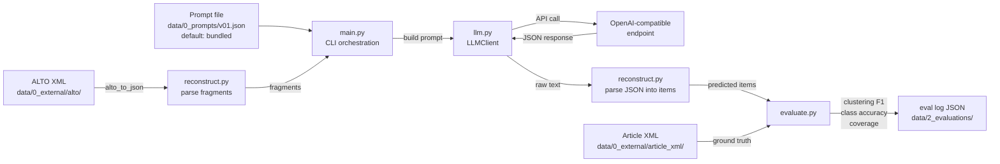

# Article Reconstruction from ALTO XML using LLM Prompting

Reconstructs newspaper articles from OCR text fragments (ALTO XML) by prompting an LLM to group fragments into complete items (articles, advertisements, etc.). Includes evaluation against ground truth article XML using pairwise clustering F1, class accuracy, and coverage metrics.

Developed for Jawi (Arabic script) Malay newspapers from the Utusan Melayu 1956 collection.

## Workflow



## Project Structure

```
article-reconstruction/
├── main.py            # CLI entry point
├── reconstruct.py    # ALTO XML parsing, article reconstruction, default prompts
├── llm.py            # LLM client (OpenAI-compatible API wrapper)
├── evaluate.py       # Ground truth parsing, clustering F1, evaluation logging
├── generate_dashboard.py # Alpine.js HTML dashboard generator for evaluation logs
├── run_evals.sh      # Batch evaluation orchestrator script
├── tests/            # Unit tests + end-to-end tests
└── data/
    ├── 0_external/   # Raw external data (git submodule)
    │   ├── alto/         # 80 ALTO XML files (OCR text fragments)
    │   └── article_xml/  # 80 ground truth article XML files
    ├── 0_prompts/      # Prompt files (v01=baseline, v02+=improved variants)
    ├── 1_interim/      # Interim processed data
    │   ├── fragments/          # Cached ALTO→JSON fragments
    │   └── reconstructions/    # LLM output caches (by prompt/model)
    └── 2_evaluations/      # Evaluation logs (JSON) and dashboard.html
```

## Installation

Requires Python 3.12+ and [uv](https://docs.astral.sh/uv/).

```bash
uv sync
```

## Configuration

Set environment variables for the LLM API, or pass them as CLI flags. Works with any OpenAI-compatible endpoint (OpenAI, Ollama, vLLM, LM Studio, etc.).

| Variable       | Description                          | Default  |
|----------------|--------------------------------------|----------|
| `LLM_API_KEY`  | API key for the LLM provider         | `"none"` |
| `LLM_MODEL`    | Model name                           | Required |
| `LLM_BASE_URL` | Custom OpenAI-compatible endpoint    | None     |

### Non-OpenAI example (local server)

```bash
LLM_BASE_URL=http://localhost:11434/v1 LLM_MODEL=llama3 \
  uv run python main.py --alto data/0_external/alto/UM-1956-01-09-6.xml
```

## Usage

### Convert ALTO to JSON (no LLM call)

```bash
uv run python main.py --alto data/0_external/alto/UM-1956-01-09-6.xml --json-only
```

### Reconstruct a single page

```bash
uv run python main.py --alto data/0_external/alto/UM-1956-01-09-6.xml
```

### Reconstruct a directory of pages

```bash
uv run python main.py --input-dir data/0_external/alto/
```

### Reconstruct + evaluate a single page

```bash
uv run python main.py --evaluate \
  --alto data/0_external/alto/UM-1956-01-09-6.xml \
  --article-xml data/0_external/article_xml/UM-1956-01-09-6.xml
```

### Reconstruct + evaluate a directory

```bash
uv run python main.py --evaluate \
  --input-dir data/0_external/alto/ \
  --ground-truth-dir data/0_external/article_xml/
```

### Save results to a file

Add `--output results.json` to any command to write to a file instead of stdout.

### Prompt files

Prompt files can be JSON (with `system_prompt` and optional `user_prompt_template` keys) or Markdown (with `# System Prompt` and `# User Prompt` heading sections). The prompt name used in output filenames comes from the file stem (e.g., `v02.json` → `v02`).

### CLI options

| Option          | Description                                          |
|-----------------|------------------------------------------------------|
| `--alto`        | Path to a single ALTO XML file                       |
| `--input-dir`   | Directory of ALTO or JSON fragment files             |
| `--article-xml` | Path to ground truth article XML (single-page eval) |
| `--ground-truth-dir` | Directory of ground truth article XML files (batch eval) |
| `--json-only`   | Convert ALTO to JSON and exit (no LLM call)          |
| `--evaluate`    | Evaluate against ground truth                         |
| `--model`       | LLM model name (overrides `LLM_MODEL`)              |
| `--base-url`    | OpenAI-compatible API base URL (overrides `LLM_BASE_URL`) |
| `--api-key`     | API key (overrides `LLM_API_KEY`)                  |
| `--system-prompt` | Custom system prompt (overrides default)           |
| `--prompt-file` | Read system prompt (and optionally user prompt template) from file (overrides `--system-prompt` and `--user-prompt-template`) |
| `--user-prompt-template` | Custom user prompt template with `{fragments}` placeholder (overrides default) |
| `--output`      | Save results to file instead of stdout              |
| `--output-dir`  | Write one JSON file per page to this directory (batch modes) |
| `--eval-dir`    | Directory for evaluation logs (default: `data/2_evaluations/`) |
| `--interim-dir` | Directory for cached JSON fragments (default: `data/1_interim`) |
| `--force`       | Re-parse ALTO XML even if cached JSON exists |
| `--sample-size` | Randomly sample N pages from the input directory |
| `--seed`        | Random seed for reproducible sampling (use with `--sample-size`) |

## Evaluation Metrics

- **Pairwise clustering F1** — Treats each item as a cluster of fragment IDs. For every pair of fragments, checks whether they are co-grouped in the prediction vs. ground truth. Reports precision, recall, and F1.
- **Class accuracy** — On items where the predicted fragment set exactly matches a ground truth item, checks whether the class label matches. Reported as a fraction (or `null` if no matches).
- **Coverage** — Fraction of ground truth fragments that appear in any predicted item.

Evaluation logs are saved as JSON files in the `--eval-dir` directory, named `{timestamp}_{provider}_{model}_{prompt_name}.json`. They contain per-page metrics, aggregate summaries (including execution time), and run configuration. The prompt name is derived from the `--prompt-file` filename stem, defaulting to `"default"`.

Run `uv run python generate_dashboard.py` to generate an interactive HTML dashboard (`dashboard.html`) in the evaluation directory to visualize these metrics.

## Testing

```bash
uv run pytest          # run all 63 tests
uv run ruff check .    # lint
uv run ruff format .   # format
```

## Data Format

### ALTO XML (input)

Each `TextBlock` with text content becomes a fragment with an ID, OCR text, bounding box, and type. `Illustration` elements and empty text blocks are skipped.

### Article XML (ground truth)

Each `Article` element has a UUID, class (`article`, `advertisement`, `obituary`, `letter`, `caption`), topics, and region references matching ALTO fragment IDs. The classes `letter` and `caption` are folded into `miscellaneous` during evaluation.
