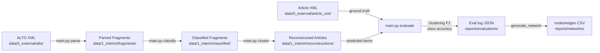

# Article Reconstruction from ALTO XML using LLM Pipelines

Reconstructs newspaper articles from OCR text fragments (ALTO XML) by prompting an LLM through a pipelined architecture (Parse → Classify → Cluster → Evaluate). Includes evaluation against ground truth article XML using pairwise clustering F1, class accuracy, and coverage metrics.

Developed for Jawi (Arabic script) Malay newspapers from the Utusan Melayu 1956 collection.

## Workflow



## Project Structure

```
article-reconstruction/
├── main.py                 # Typer CLI entry point (parse, classify, cluster, evaluate)
├── dashboard.html          # Standalone Alpine.js HTML dashboard for evaluation logs
├── generate_network.py     # Export eval logs to nodes/edges CSV for the network visualizer
├── pipeline.sh             # Single run evaluation orchestrator script
├── run_experiments.sh      # Batch evaluation grid-search script
├── src/
│   └── newspaper_reconstructor/
│       ├── reconstruct.py  # Data parsing and LLM API mapping
│       ├── llm.py          # LLM client wrapper
│       ├── evaluate.py     # Ground truth parsing, evaluation metrics
│       └── suggest.py      # LLM judge offline analysis tool
├── tests/                  # Unit tests + end-to-end tests
├── prompts/                # Prompt files (e.g. classify.md, v00.md)
├── reports/
│   ├── evaluations/        # Evaluation logs (JSON)
│   ├── networks/           # Exported nodes/edges CSV for the network visualizer
│   └── suggestions/        # Output from the LLM judge
└── data/
    ├── 0_external/           # Raw external datasets
    │   └── <dataset_name>/   # E.g. ds-filteredUM1956alto (git submodule)
    │       ├── alto/         # ALTO XML files (OCR text fragments)
    │       └── article_xml/  # Ground truth article XML files
    └── 1_interim/            # Interim pipeline I/O
        └── <dataset_name>/
            ├── fragments/        # Parsed JSON fragments
            ├── classified/       # JSON fragments enriched with 'predicted_class'
            └── reconstructions/  # LLM clustered articles (organized by run_id)
```

## Installation

Requires Python 3.12+ and [uv](https://docs.astral.sh/uv/).

```bash
uv sync
```

## Configuration

Set environment variables for the LLM API, or pass them as CLI options. Works with any OpenAI-compatible endpoint (OpenAI, Ollama, vLLM, LM Studio, etc.).

| Variable         | Description                       | Default                                               |
| ---------------- | --------------------------------- | ----------------------------------------------------- |
| `LLM_API_KEY`    | API key for the LLM provider      | `"none"`                                              |
| `LLM_MODEL`      | Model name                        | Required                                              |
| `LLM_BASE_URL`   | Custom OpenAI-compatible endpoint | None                                                  |
| `IMAGE_BASE_URL` | Base URL for page scan images     | `https://jawi.sgp1.digitaloceanspaces.com/page_scans` |

## Usage

The CLI is built with `typer` and uses subcommands to execute discrete steps of the pipeline.

### 1. Parse ALTO XML to JSON
Converts raw XML to JSON fragment lists (no LLM required).

```bash
uv run python main.py parse -i data/0_external/alto -o data/1_interim/fragments
```

### 2. Classify Fragments
Uses an LLM to assign classes (headline, body, caption, etc.) to each fragment.

```bash
uv run python main.py classify \
  -i data/1_interim/fragments \
  -p prompts/classify.md \
  -o data/1_interim/classified
```

### 3. Cluster Fragments into Articles
Uses an LLM to group fragments into complete articles. Can accept raw parsed fragments or classified fragments as input.

```bash
uv run python main.py cluster \
  -i data/1_interim/classified \
  -p prompts/v00.md \
  -o data/1_interim/reconstructions/my_run \
  --sort-fragments
```

### 4. Evaluate Reconstructions
Evaluates predicted articles against the ground truth.

```bash
uv run python main.py evaluate \
  -i data/1_interim/reconstructions/my_run \
  -g data/0_external/article_xml \
  --run-id "my_run_v00"
```

### 5. Generate Suggestions (LLM Judge)
Generate systemic prompt and heuristic improvement suggestions based on the worst-performing pages of a specific evaluation run:

```bash
uv run python main.py suggest --run-id "my_run_v00"
```

## Prompt Files

Prompt files can be JSON (with `system_prompt` and optional `user_prompt_template` keys) or Markdown (with `# System Prompt` and `# User Prompt Template` heading sections).

## Evaluation Metrics

- **Pairwise clustering F1** — Treats each item as a cluster of fragment IDs. For every pair of fragments, checks whether they are co-grouped in the prediction vs. ground truth. Reports precision, recall, and F1.
- **Class accuracy** — On items where the predicted fragment set exactly matches a ground truth item, checks whether the class label matches. Reported as a fraction (or `null` if no matches).
- **Coverage** — Fraction of ground truth fragments that appear in any predicted item.

Evaluation logs are saved as JSON files in the `--eval-dir` directory. They contain per-page metrics, aggregate summaries (including execution time), and run configuration.

Open `dashboard.html` in your browser and select the project folder (or host it with a local server) to visualize these metrics.

### Export for Network Visualization

Export an evaluation log to nodes and edges CSV files for the [article-network-visualizer](https://github.com/nus/Jawi-Newspapers/article-network-visualizer):

```bash
uv run python generate_network.py --eval-log reports/evaluations/<file>.json
```

**Options:**
- `--output-dir`: Base output directory (default: `reports/networks`, env: `OUTPUT_DIR`)
- `--image-base-url`: Base URL for page scan images (default: `https://jawi.sgp1.digitaloceanspaces.com/page_scans`, env: `IMAGE_BASE_URL`)
- `--interim-dir`: Directory for cached fragments (default: `data/1_interim`, overridden by `input_folder` in evaluation config if present)
- `--eval-name`: Override the auto-generated evaluation subdirectory name

This creates one CSV per page in `reports/networks/{eval_name}/nodes/` and `reports/networks/{eval_name}/edges/`. Nodes carry per-fragment coordinates, OCR text, and segment assignments (`{model}_segment`, `ground_truth_segment`). Edges connect fragments within the same LLM-predicted item and include an `edge_weight` column (`1.0` when the grouping agrees with ground truth, `-1.0` when it does not). Page-level evaluation metrics (`clustering_f1`, `bcubed_f1`, `coverage`, `class_accuracy`, `tp`, `fp`, `fn`) are appended as constant columns on every edge row.

## Testing

```bash
uv run pytest          # run all tests
uv run ruff check .    # lint
uv run ruff format .   # format
```

## Data Format

### ALTO XML (input)

Each `TextBlock` with text content becomes a fragment with an ID, OCR text, bounding box, and type. `Illustration` elements and empty text blocks are skipped.

### Article XML (ground truth)

Each `Article` element has a UUID, class (`article`, `advertisement`, `obituary`, `letter`, `caption`), topics, and region references matching ALTO fragment IDs. The classes `letter` and `caption` are folded into `miscellaneous` during evaluation.
